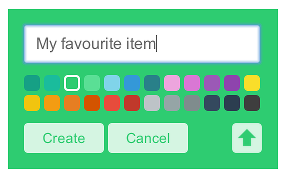
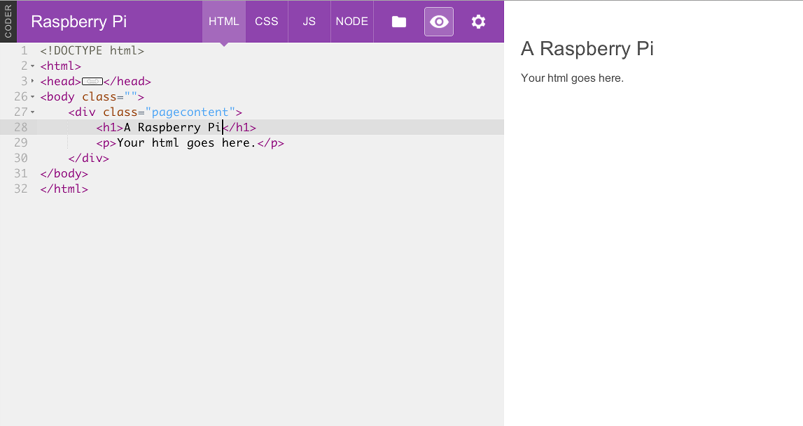
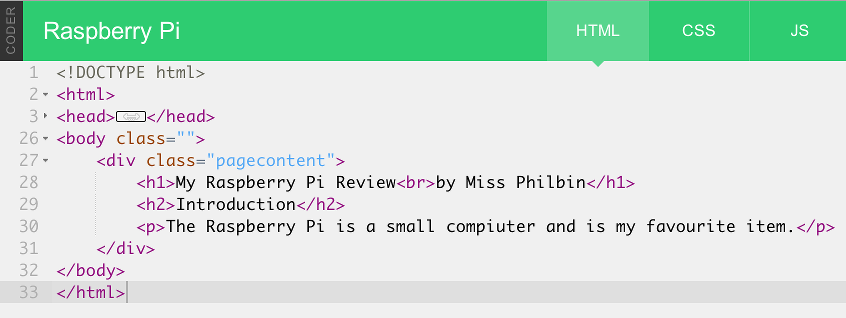

## Student Instructions

### Setting up your Raspberry Pi using Google Coder

The Raspberry Pi is a barebones computer. It’s really pretty useless on its own. In order to puse it as a webserver and create websites on it, we need to connect a number of things to it:

- An SD card. This card contains the Google Coder that can be loaded onto the Raspberry Pi in order for it to do things. You need to slide the card into the slot with the metal pins facing in towards the Raspberry Pi. The label should be visible when it is inserted.
- An ethernet cable or wifi adapter. This will allow you to connect the Raspberry Pi to a local network to host your website projects on.
- A power adapter. Plug the power adapter into a socket and then the small USB connector into the Raspberry Pi. When you turn the socket switch on, you should see the Raspberry Pi flash and text should appear on the monitor.

*Note: A monitor, keyboard & mouse are not necessary, as you will connect to the RPi from a computer internet browser on the same network.*

### Connect to your Raspberry Pi Coder Server

Now you have connected your Raspberry Pi to the local network you can use a computer and laptop to connect to it. You will see that after you plugged in the power cable to the RPi some lights came on, this indicates that your RPi Coder server is booting up. 

1. Give it a few minutes to boot, and then in your web broswer on your computer type:

  ```
  http://coder.local/
  ```
  Don't forget the `http://` part!

2. Or to the Coder number given to you by your teacher. e.g. `http://coder01.local/` or `http://coder02.local/` 

3. Once connected you will see a screen asking you to setup a password to protect your server. With your partner set a password. *Note: You will need to make sure that you remember your password every lesson, or your work will be lost. Why not use the RPi default password `raspberry`*

### Make a New Coder Webpage

On the main Coder page you will see a grid of boxes with names on them. These are projects (also called apps), some are webapges, and some are game. There are a few that come pre-installed on Coder. Last lesson you looked at the **Hello Coder** project.

1. At the top left of the screen you should see a green box with a plus sign. Click the **plus** to start creating a new project.

2. Give it a name and pick a color. You are going to make a webpage containing a review so give it a name to reflect it's contents like "My favourite item".

	

3. Once you’ve got a name and color, press **Create**. You should go straight into editing your new project.

4. When you create a new webpage you start in the "Code View" of Coder. The building blocks that will make up your website. Click on the icon in the top right hand corner that looks like an eye. This will show you a preview of what your webpage will look like.

	
	
### Project Settings

You can change the colour that you have used for your new project and even add your name so that you know it is your work. To do this click on the icon of a cog that represents **settings** next to the **preview** eye icon. Then add your name, and should you wish a new colour for your project icon.


### Headings & Titles

All Coder projects start with a little bit of code already in them. For example, lines that begin with bits of code that have pointed brackets like `<word>` are called tags.

Tags are the bits of HTML that define the structure and content of a site. They are very important in HTML. All tags have an open tag and a close tag. A close tag looks like this </tag>. See that slash? That’s what makes a closed tag close. All tags need an opening and a closing or else they won’t work.

1. Add the information about your favourite item by first finding the `<h1>` tag. This is the tag for a heading. Right now the heading looks like this:

	`<h1>Hello World</h1>`

2. Change the text between the tags to the name of your item or tv show/game.

3. Save your changes by clicking on the **Save** button at the bottom of the screen and take a look at the preview window. See how the larger heading text has changed? That is because you changed the text inside the tag. 


### Other ways to display text

Titles are important, but you will want to have different styles of text on your review webpage. In this section we will look at two other ways to display text.

1. You may wish to break a line of text so it goes over more than one line. The following title is a little bit too long:

	`<h1>My Raspberry Pi Review by Miss Philbin</h1>`

	I can use the `<br>` tag to break it into two like this:

	`<h1>My Raspberry Pi Review<br>by Miss Philbin</h1>`

2. Break your heading so that it goes over two lines. Then click on **Save** and see how it looks in the preview window by clicking on the picture of an eye.

3. Next change the paragraph tag beneth the heading that looks like this:

	`<p>Your html goes here.</p>`

	Remove the text between the tags and replace it with your introduction text about your favourite item. For example:

	`<p>The Raspberry Pi is a small compiuter and is my favourite item. </p>`
	
4. Now save that and take a look. 

5. Above your introduction paragraph you can text to act as a sort of subheading. This could be text that is important but not as important as the title.

	Add an `<h2>` tag. It’s a headline, like the `<h1>` but won’t be as prominent. The `<h2>` tag should read **Introduction**.

	You code should look something like this:

	

6. Don't forget to save and preview your page to see what it looks like.

### Horizontal Line

It is always nice to underline headings on a page to separate them from the body of text. You can do this with a simple tag!

Underneath your main heading using the `<h1>` tag type: 

`<hr />`

HR stands for “Horizontal Rule” and it’s a HTML element designed to divide content on a page.

