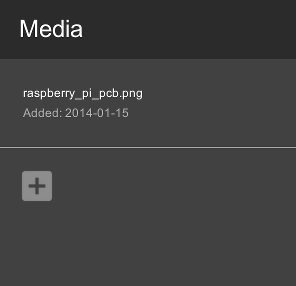

## Student Instructions - Images & Videos

### Setting up your Raspberry Pi using Google Coder

The Raspberry Pi is a barebones computer. It’s really pretty useless on its own. In order to use it as a webserver and create websites on it, we need to connect a number of things to it:

- An SD card. This card contains the Google Coder that can be loaded onto the Raspberry Pi in order for it to do things. You need to slide the card into the slot with the metal pins facing in towards the Raspberry Pi. The label should be visible when it is inserted.
- An ethernet cable or wifi adapter. This will allow you to connect the Raspberry Pi to a local network to host your website projects on.
- A power adapter. Plug the power adapter into a socket and then the small USB connector into the Raspberry Pi. When you turn the socket switch on, you should see the Raspberry Pi flash and text should appear on the monitor.

*Note: A monitor, keyboard & mouse are not necessary, as you will connect to the RPi from a computer internet browser on the same network.*

### Connect to your Raspberry Pi Coder Server

Now you have connected your Raspberry Pi to the local network you can use a computer and laptop to connect to it. You will see that after you plugged in the power cable to the RPi some lights came on, this indicates that your RPi Coder server is booting up. 

1. Give it a few minutes to boot, and then in your web broswer on your computer type:

  ```
  http://coder.local/
  ```
  Don't forget the `http://` part!

2. Or to the Coder number given to you by your teacher. e.g. `http://coder01.local/` or `http://coder02.local/` 

3. Once connected you may get a security certifcate warning screen, click it is ok to proceed.  Then will see a screen asking you to type a password. Use the password that you setup during th first lesson. E.g. `raspberry`.

4. Load your project page fromthe last lesson by clicking on the project icon.

### Adding an Image

Currently, your webpage has some text written using different styles. You can make it more interesting by adding some pictures of the item you are reviewing.

1. Add a new line of code and a new `<hr />` tag underneath the main heading.

2. Between the two `<hr />` tags, add an `` tag. It’s one of those tags that doesn’t need a close tag. Like `<hr />`. It should look like this: 

	```html
	<hr />
	
	<hr />
	```
	
	Notice the `src=""` part. That's an attribute of the img tag that will let you specify the image that you want to use.

3. Navigate to the top right hand side of the screen. Click on the **Media** button (The one that looks like a folder).

4. Click the `“+”` button. You should get a prompt to upload a file. Select an image of your choice from somewhere on your computer where it is saved.

5. Once the image is uploaded, you should see its name and the date it was uploaded appear. Roll over it with your mouse. Notice how two buttons (“Paste to Code” and “Delete”) appear?

	 

6. Go back to the HTML side, keeping the media drawer option. Position your cursor in between the two quote symbols `("")` in the `` tag we created. With the cursor still in that position, go back to the media drawer and click on the **paste to code** button. A bunch of text that looks a little bit like a website address should appear between the quotes. That's the path to your image file. It should look something like this:

	``

7. Save your code and take a look at the preview version, did the image appear?

8. If you added your own image, it might be too big or too small. You can shrink it down and change its size within the `` tag by adding height and width attributes. For example:

	``
	
	Try adding height and width attributes to your `` tag. See what happens when you only use either the height or width attribute, but not the other. Did the image get squished or did it stretch evenly? Play around with different measurements until you like the way it looks on the page.


### Embedding Videos

Images and text are the main focus of many websites. Nowadays video content is becoming more important. If you have access to a video streaming site like YouTube or Vimeo then why not embed a video on your webpage too!

1. Locate the video on a video streaming site like YouTube, once you have found one you want to use click on the **Share** button. Click on **embed** and you will see a chunk of html code that starts with `<iframe>`. This tag allows you to embedd content like videos into webpages and blog posts.

2. Copy the code by using the keyboard shortcut **CTRL + C** and navigate back to your Coder project page.

3. Paste the code underneath a horizontal line or heading by using the keyboard shortcut **CTRL+V** Your code should look like this:

	```html
	<h1>My Raspberry Pi Review<br>by Miss Philbin</h1>
	<hr />
    
    <hr />
    <h2>Introduction</h2>
    <br>
    <iframe width="560" height="315" src="//www.youtube.com/embed/jr6IVLZmp28?list=PL455284BB15D6E8F0" frameborder="0" allowfullscreen></iframe>
    <p>The Raspberry Pi is a small computer and is my favourite item. This is a video that explains what a Raspberry Pi is and how to set one up for the first time!</p>
	```


