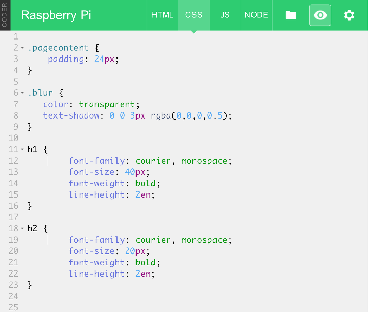
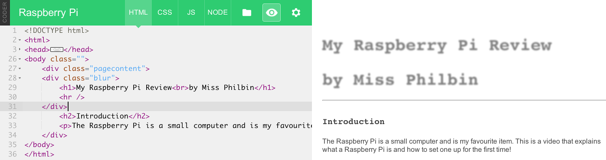

## Student Instructions - Adding Some Style

### Setting up your Raspberry Pi using Google Coder

The Raspberry Pi is a barebones computer. It’s really pretty useless on its own. In order to use it as a webserver and create websites on it, we need to connect a number of things to it:

- An SD card. This card contains the Google Coder that can be loaded onto the Raspberry Pi in order for it to do things. You need to slide the card into the slot with the metal pins facing in towards the Raspberry Pi. The label should be visible when it is inserted.
- An ethernet cable or wifi adapter. This will allow you to connect the Raspberry Pi to a local network to host your website projects on.
- A power adapter. Plug the power adapter into a socket and then the small USB connector into the Raspberry Pi. When you turn the socket switch on, you should see the Raspberry Pi flash and text should appear on the monitor.

*Note: A monitor, keyboard & mouse are not necessary, as you will connect to the RPi from a computer internet browser on the same network.*

### Connect to your Raspberry Pi Coder Server

Now you have connected your Raspberry Pi to the local network you can use a computer and laptop to connect to it. You will see that after you plugged in the power cable to the RPi some lights came on, this indicates that your RPi Coder server is booting up. 

1. Give it a few minutes to boot, and then in your web broswer on your computer type:

  ```
  http://coder.local/
  ```
  Don't forget the `http://` part!

2. Or to the Coder number given to you by your teacher. e.g. `http://coder01.local/` or `http://coder02.local/` 

3. Once connected you may get a security certifcate warning screen, click it is ok to proceed.  Then will see a screen asking you to type a password. Use the password that you setup during th first lesson. E.g. `raspberry`.

4. Load your project page from the last lesson by clicking on the project icon.

### Adding Style using CSS

So far you have been using html to create your webpage. This has enabled you to add content like text and images to it. By now, you'll be wanting to make it look much cooler with colour and different fonts.

The text on your website has had the deafult font applied to it which is a bit boring, but you can change that by clicking on the **CSS panel** icon at the top of the screen.


*CSS stands for “Cascading Style Sheets.”* When you click on the panel you will see the following code:

```css
.pagecontent {
    padding: 24px;
}
```

CSS is what we use to style HTML elements such as the text. Just like HTML tags, it needs to be written a specific way to work.

CSS looks different to the HTML you have used so far in your project. They use curly brackets and the placement of these is very important.


1. Change the number next to padding from **24px** to **300px**.

2. Click on **Save** at the bottom of the page.

3. Then a look at the preview. See how the all the content shifted? That’s because we increased the padding, or space between the inside of the box and the text and images.

	CSS styles affect the way things look in the HTML. It’s in this tab that will make your text look pretty by changing fonts and colors.

4. Change the padding size to something more pleasing to look at like 50.

	```css
	.pagecontent {
    	padding-left: 50px;
    	padding-right: 50px;
	}
	```

### Get Funky with Fonts

Font choice is very important when creating digital content like a webpage. You need to consider your audience. Easy to read fonts are better to use if you have text you would like everyone tobe able to read. Crazy artisit fonts are useful to make headings and bits of text stand out. Let's begin by making `<h1>` headings feel like a real headline.

1. Click on the CSS tab at the top of the screen.
2. Write h1. The CSS will then change the style of every h1 tag in your HTML. 
3. After that, add an open curly bracket. 
4. Press enter twice on the keyboard and add a close curly bracket. Your code should now look like this:

	```css
	h1 {
	}
	```
	
5. On the empty line in between the curly brackets, add the property font-family and make its value courier, monospace. This will change the font for `<h1>` to Courier, and if Courier isn't on your computer, it will fall back to using a default monospace font.

	```css
	h1 {
    	font-family: courier, monospace;
	}
	```
	
6. Save the code and take a look at it in the preview window. The header should look different now.

7. Let’s keep styling the heading by adding the size of the font, the weight of the font (such as bold, italic and so on) and the height of the line of text like this:

	```css
	h1 {
    	font-family: courier, monospace;
    	font-size: 50px;
    	font-weight: bold;
    	line-height: 2em;
	}
	```
	
8. Save the code and take a look at it in the preview window. The title should be big and bold now with a little more space around it. 

	*Note: px is used to specify size in screen pixels, but em is used to measure things based on the size of the font. 2em means make the line-height 2 times the size of the font.* 
	
	
	
9. 	You can use any font-family that you like. A good way to find one you like and that name of it, is to look at the fonts in another application like word or photoshop. 
10. Change the size and styles of the fonts for `<h2>` and `<p>` text too!

	
### Other Fun Things to do with Fonts

You can use CSS to apply all sorts of fun styles. For example, why not make the text look a little blurry or...

1. In the **CSS panel** type the following code underneath the `.pagecontent` section in curly brackets and above the `h1` section:

	```css
	.blur {
		color: transparent;
		text-shadow: 0 0 5px rgba(0,0,0,0.5);
	}
	```
	
	

2. Click on the **HTML panel** to view the html code and underneath the line `<div class="pagecontent">` type the following line:

	```html
	<div class="blur">
	```

3. Remember most html tags have an open and a clode tag. Adding a new div class, adds a new opening tag. Therefore you need to add the closing tag '</div>'. Place this closing tag above `<h2>Introduction</h2>` like this:

	 	
	
4. Click on the Save button and preview what your heading font looks like now! You can always remove this effect by deleting the `<div class="blur">` and `</div>` tags.	