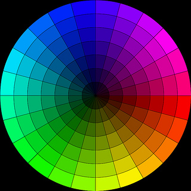

## Student Instructions - Colour

### Setting up your Raspberry Pi using Google Coder

The Raspberry Pi is a barebones computer. It’s really pretty useless on its own. In order to use it as a webserver and create websites on it, we need to connect a number of things to it:

- An SD card. This card contains the Google Coder that can be loaded onto the Raspberry Pi in order for it to do things. You need to slide the card into the slot with the metal pins facing in towards the Raspberry Pi. The label should be visible when it is inserted.
- An ethernet cable or wifi adapter. This will allow you to connect the Raspberry Pi to a local network to host your website projects on.
- A power adapter. Plug the power adapter into a socket and then the small USB connector into the Raspberry Pi. When you turn the socket switch on, you should see the Raspberry Pi flash and text should appear on the monitor.

*Note: A monitor, keyboard & mouse are not necessary, as you will connect to the RPi from a computer internet browser on the same network.*

### Connect to your Raspberry Pi Coder Server

Now you have connected your Raspberry Pi to the local network you can use a computer and laptop to connect to it. You will see that after you plugged in the power cable to the RPi some lights came on, this indicates that your RPi Coder server is booting up. 

1. Give it a few minutes to boot, and then in your web broswer on your computer type:

  ```
  http://coder.local/
  ```
  Don't forget the `http://` part!

2. Or to the Coder number given to you by your teacher. e.g. `http://coder01.local/` or `http://coder02.local/` 

3. Once connected you may get a security certifcate warning screen, click it is ok to proceed.  Then will see a screen asking you to type a password. Use the password that you setup during th first lesson. E.g. `raspberry`.

4. Load your project page from the last lesson by clicking on the project icon.

### A Splash of Colour

Last lesson you started to add some style to your webpage using CSS, concentrating on styles of fonts and changing their attributes like size and weight. This lesson will build on the CSS you have already learned to change the colours of different elements of your webpage.

1. Sometimes it can be difficult to know what colours to use that compliment each other. You can use a [Colour scheme designer like this](http://colorschemedesigner.com/) to help. 
2. Find some colours that you would like to use for your text.



### Adding Colours in CSS

All the text used on your webpage is a default black colour. You can give each type of text a colour in the **CSS panel**. 

1. Click on the CSS tab at the top of the screen.
2. Navigate to the part of the code for **h1**
3. add the following line of code `color: magenta;` underneath the font settings before the curly bracket like this:

	```css
	h1 {
    	font-family: courier, monospace;
    	font-size: 40px;
   		font-weight: bold;
    	line-height: 2em;
    	color: magenta;
	}
	```
	*Note: You will need to use the American spelling of 'colour' in your code for it to work!*

4. Now save your changes and preview what they look like using the preview button. Was it the colour that you were expecting to see? What happens if you replace `magenta` with `blue`? 

	As you can see, you can use color names to apply colors in CSS. These are generic values, though and aren’t always exactly the color you want. If you want a little more control over color then you’ll need to use Hex values.

	Hex values are codes that help a browser show color. They look like this: `#FF0000`. That’s the hex value for red. Hex codes are six digits long, and contain only the number 0-9 and the letters A-F.

	Here are some other example hex values:
	
	```css
	#00FF00 - only green
	#0000FF - only blue
	#C0392B - softer red
	#16A085 - softer green
	#3498D8 - softer blue
	#D977D4 - pink
	#F1C40F - yellow
	#F39C12 - orange
	#FFFFFF - white
	#000000 - black
	#999999 - grey
	```

5. Change the colours of all of your text styles using hex codes from the colour scheme designer webpage you used at the start of the lesson. Hover your mouse over a colour you like and it will give you the hex value for it.

### Changing the Background Colour

Text is not the only element of the webpage that you may wish to choose a colour for. Currently the background is a default white colour. Let's change that by adding a style.

1. Make sure that you have the **CSS panel** selected and navigate to the end of your code.
2. Add the following:

	```css
	body {
    	background-color:#b0c4de;
	}
	```

3. Click on **save** and then click on the preview button to see what happens. 
4. If you do not like the colour, then you can change it by replacing the hex value to something else. 
5. No need to end there, you can also change the background colour of your text. Navigate to **h1** and add this line `background-color:#6495ed;` after the text colour and before the closing curly bracket like this:

	

### Background Image

Instead of using one colour for the background, you could use an image instead. To do this you will need to find an image that you want to use, save it somewhere on your computer and then upload it to coder using the Media folder. Just like you did in lesson 3.

1. Click on the **Media** button that looks like a picture of a folder.
2. Click the `“+”` button. You should get a prompt to upload a file. 
3. Select an image of your choice from somewhere on your computer where it is saved.
4. Once the image is uploaded, you should see its name and the date it was uploaded appear. 

	

5. Click on the **CSS panel** and replace `background-color` with `background-image:url("image.jpg")` like this:

	```css
	body {
    	background-image:url("");
	}
	```		

6. 	To add the location of the image, click between `(" ")`, then with the media folder open click on **paste to code** and the url of the image will be added. 

7. Save your work so far and then see if it has worked by clicking on the preview window. You should end up with code that looks something like this:

	```css
	body {
    	background-image:url("/static/apps/raspberry_pi/media/Raspi_Colour_R.png");
	}
	```
	
		