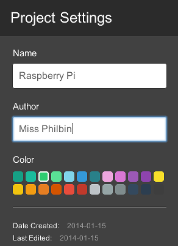
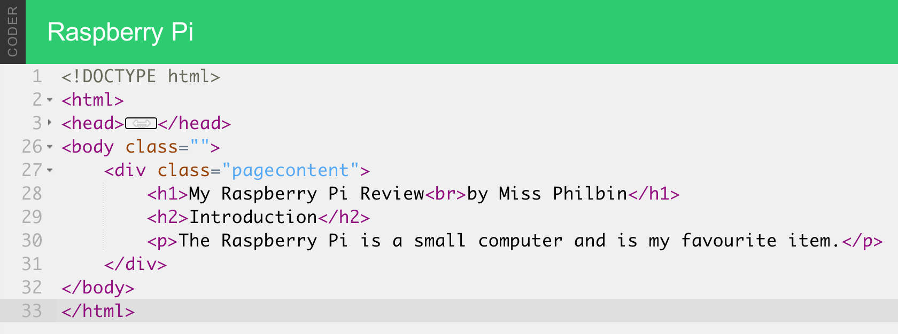

# Student Instructions

## Setting up your Raspberry Pi using Google Coder

The Raspberry Pi is a bare bones computer. It’s not much use on its own. In order to use it as a webserver and create websites on it, we need to connect a number of things to it:

- An SD card. This card contains the Google Coder that can be loaded onto the Raspberry Pi in order for it to be used to create websites. You need to slide the card into the slot with the metal pins facing in towards the Raspberry Pi. The label should be visible when it is inserted.
- An ethernet cable or wifi adaptor. This will allow you to connect the Raspberry Pi to a local network to host your website projects on.
- A power adaptor. Plug the power adaptor into a socket and then the small USB connector into the Raspberry Pi. When you turn the socket switch on, you should see the Raspberry Pi flash and text should appear on the monitor.

*Note: A monitor, keyboard and mouse are not necessary, as you will connect to the Raspberry Pi from an internet browser on a different computer on the network.* 

## Connect to your Raspberry Pi Coder Server

Now you have connected your Raspberry Pi to the local network you can use a computer or laptop to connect to it. You will see that after you plugged in the power cable some lights came on; this indicates that your Raspberry Pi Coder server is booting up. 

1. Give it a few minutes to boot, and then in the web browser on your computer type:

  ```
  http://coder.local/
  ```
  Don't forget the `http://` part!

2. You might have to enter the Coder number given to you by your teacher instead, for example `http://coder01.local/` or `http://coder02.local/`.  

3. Once connected, you may see a security certificate warning screen; it is OK to click the button to 'proceed anyway'. Then you will see a screen asking you to type a password. Use the password that you set up during the first lesson, for example 'raspberry'.

4. Load your project page from the last lesson by clicking on the project icon.

## Make a New Coder Webpage

On the main Coder page you will see a grid of boxes with names on them. These are projects (also called apps); some are webpages and some are games. There are a few that come pre-installed on Coder. Last lesson you looked at the 'Hello Coder' project.

1. At the top left of the screen you should see a green box with a plus sign. Click the plus to start creating a new project.

2. Give it a name and pick a colour. You are going to make a webpage containing a review, so give it a name to reflect its contents such as "My favourite item".

	

3. Once you’ve chosen a name and colour, press **Create**. You should go straight into editing your new project.

4. When you create a new webpage, you start in the "Code View" of Coder. This contains the building blocks that will make up your website. Click on the icon that looks like an eye in the top right of the screen. This will show you a preview of what your webpage will look like.

	
	
## Project Settings

You can change the colour that you have used for your new project, and even add your name so that you know it is your work. To do this, click on the icon of a cog that represents **settings** next to the **preview** eye icon. Then add your name, and a new colour for your project icon should you wish.



## Headings & Titles

All Coder projects start with some code already in them. For example, lines that begin with code with pointed brackets like `<word>` are called tags.

Tags are the bits of HTML that define the structure and content of a site; they are very important. All tags have an open tag and a close tag. A close tag looks like `</tag>`. The slash at the start is what makes a close tag close. All tags need an opening and a closing or else they won’t work.

1. Add the information about your favourite item by first finding the `<h1>` tag; this is the tag for a heading. Right now the heading looks like this:

	`<h1>Hello World</h1>`

2. Change the text between the tags to the name of your item or TV show/game.

3. Save your changes by clicking on the **Save** button at the bottom of the screen and take a look at the preview window. The larger heading text has now changed; that is because you changed the text inside the tag. 


## Other Ways to Display Text

Titles are important, but you will want to have different styles of text on your review webpage. In this section we will look at two other ways to display text.

1. You may wish to break a line of text so it goes over more than one line. The following title is a little bit too long:

	`<h1>My Raspberry Pi Review by Miss Philbin</h1>`

	I can use the `<br>` tag to break it into two lines like this:

	`<h1>My Raspberry Pi Review<br>by Miss Philbin</h1>`

2. Break your heading so that it goes over two lines. Then click on **Save** and see how it looks in the preview window by clicking on the picture of an eye.

3. Next, change the paragraph tag beneath the heading that looks like this:

	`<p>Your html goes here.</p>`

	Remove the text between the tags and replace it with your introduction text about your favourite item. For example:

	`<p>The Raspberry Pi is a small computer and is my favourite item. </p>`
	
4. Now save that and take a look. 

5. Above your introduction paragraph you can add text to act as a subheading. This could be important text that is not quite as important as the title.

	Add an `<h2>` tag. It’s a heading like the `<h1>` but it won’t be as prominent. The `<h2>` tag should read **Introduction**.

	Your code should look something like this:

	

6. Don't forget to save and preview your page to see what it looks like.

## Horizontal Line

It is always nice to underline headings on a page to separate them from the body of text. You can do this with a simple tag!

Underneath your main heading using the `<h1>` tag type: 

`<hr />`

HR stands for “Horizontal Rule” and it’s an HTML element designed to divide content on a page.


